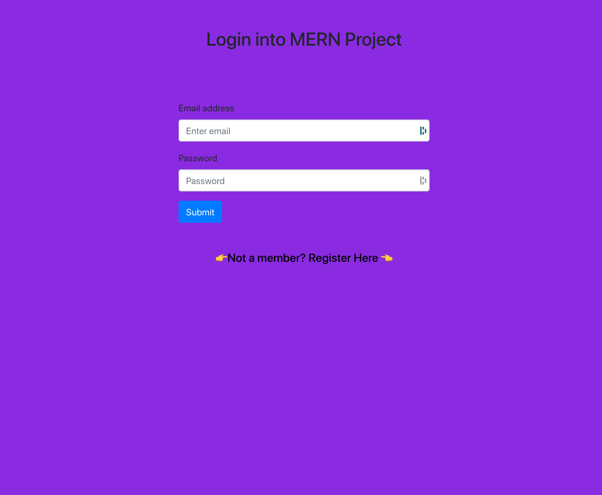
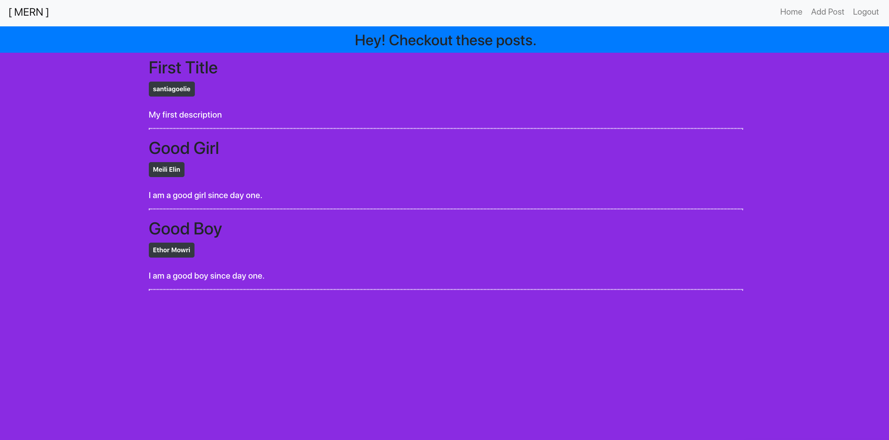
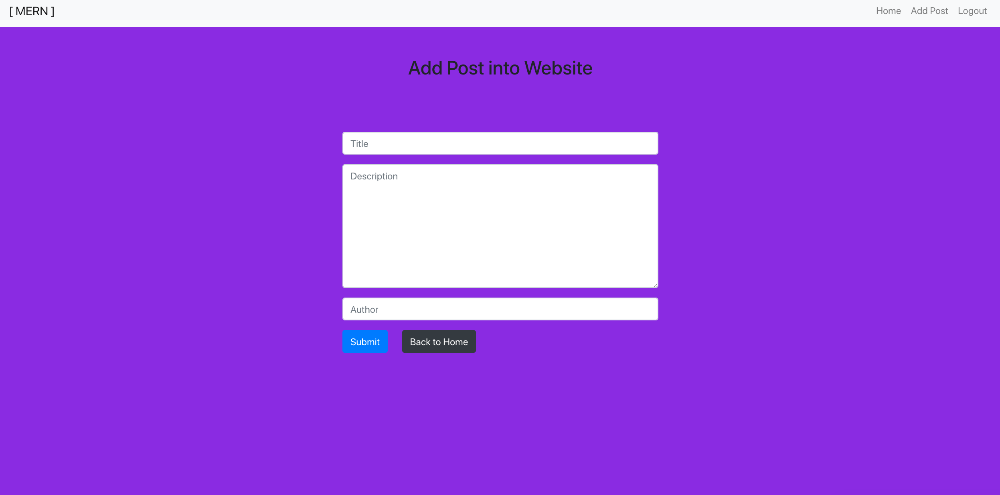

# node-express-project
## Project 5: Node Express
____________________________________________
#### User Stories:
###### 1. "As a web developer, I always wanted to create a blog site that users can log in, edit, delete, and logout. Because this idea is the most common on every web project that users can have an account and they do what they want to do."
###### 2. "As Junior Developer, we want to learn how to create a website that how a user interacts with the website. We also want our account is feeling secure from any kind of threat. Security is our priority as a developer that the user’s information is secured from all the time."

____________________________________________

#### Wireframes:
##### 1. Login View:

##### 2. Home View:

##### 3. Add_Post View:

____________________________________________

#### Project URL: https://nodeprojectblog.herokuapp.com/

____________________________________________

#### Name: Eliezer Santiago
#### Overview/Description of Project: Node Express Project
#### Details: MERN blog project
#### Technologies used: JavaScript, NodeJS, ReactJS, HTML, CSS, MongoDB, Express
#### Ideas for future improvement:
###### 1. I want to focus more on user’s information security that how can I improved the system security from any kind of threat because having a website that users can register with their information and having login information is my top priority.
###### 2. Also, to improve the user's interface by adding more designs and to make it simpler to interact and easy to understand by the users. 
###### 3. By adding more features that users have many options on how to add posts and see their post with the blog site. And also, by adding extra customization, links and many more.
